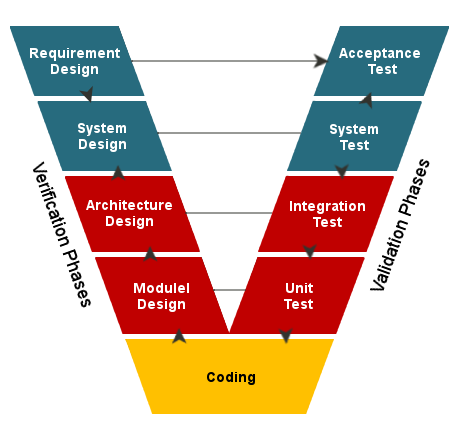

## Software Development Methodologies ##

__Waterfall Model__:
- Sequential approach with distinct phases: Requirements, Design, Implementation, Testing, Deployment, Maintenance.
- Progression is linear and moves in one direction, resembling a waterfall.
- Each phase must be completed before the next one begins.
- High documentation requirements.
- Suitable for projects with well-defined requirements and stable scope.

__Iterative Development__: 
- Cycles of development where a small portion of the software is developed in each iteration.
- Each iteration goes through all phases of the SDLC.
- After each iteration, feedback is collected and used to refine subsequent iterations.
- Useful when requirements are not well-understood initially or when frequent feedback is desired.

__Incremental Development__: 
- Similar to the iterative model but focuses on delivering increments of the software product at predefined intervals.
- Each increment adds new functionality to the product.
- Useful for large projects where it's beneficial to deliver functionality in stages.

__V-Model (Verification and Validation Model)__:

- Extension of the waterfall model.
- Emphasizes the relationship between each phase of development and its associated testing phase.
- Testing activities are planned alongside development activities.
- Ensures that each phase's deliverables are validated before proceeding to the next phase.
- Helps in early detection and correction of defects.

__Spiral Model__: 
- Combines iterative development with elements of the waterfall model.
- Iteratively develops the product through a series of cycles, each representing a phase of the SDLC.
- Each cycle involves risk analysis, allowing for mitigation strategies to be incorporated.
- Suitable for large, complex projects where risk management is critical.

__RAD (Rapid Application Development) Model__: 
- Emphasizes rapid development and iteration.
- Focuses on shortening the development lifecycle by using prototyping, iterative development, and reusable components.
- Involves close collaboration between developers and users to quickly build and refine the software.
- Typically involves the use of pre-built components or frameworks to accelerate development.
- Designed to deliver a high-quality product quickly by focusing on essential features first and iterating based on user feedback.
- Suitable for projects with tight deadlines and where time-to-market is critical.

__Prototyping Model__:
- Involves the creation of a prototype (a preliminary version of the software) to demonstrate its functionality to users and gather feedback.
- The prototype is refined through multiple iterations based on user feedback until the final product meets user requirements.
- Useful when requirements are not well-understood initially or when user needs are likely to evolve.
- Often used for exploring new concepts or technologies, or when there's a high level of uncertainty about requirements.
- Focuses on understanding user needs and refining the solution based on user feedback.

__Lean Software Development__: Lean software development focuses on delivering value with minimal waste, which aligns well with current trends towards efficiency and continuous improvement. It's considered favorable due to its emphasis on customer value and eliminating non-value-added activities.

__DevOps__: 
- Integrates software development (Dev) and IT operations (Ops) to reduce the time between committing a change to a system and the change being placed into normal production.
- Focuses on automation, collaboration, and monitoring throughout the SDLC.
- Aims to deliver high-quality software more quickly and reliably.
- It's considered favorable due to its focus on continuous integration, continuous delivery, and feedback loops.

__Agile Methodology__: 

- Emphasizes flexibility and customer collaboration over rigid planning and documentation.
- Iterative and incremental approach.
- Requirements and solutions evolve through the collaborative effort of cross-functional teams.
- Adaptive planning, continuous improvement, and rapid delivery of working software.
- Suitable for projects with changing or unclear requirements, where frequent feedback and adaptation are essential.
- Agile methodologies like Scrum, Kanban, and Extreme Programming (XP) are highly favored in the current software development landscape.

