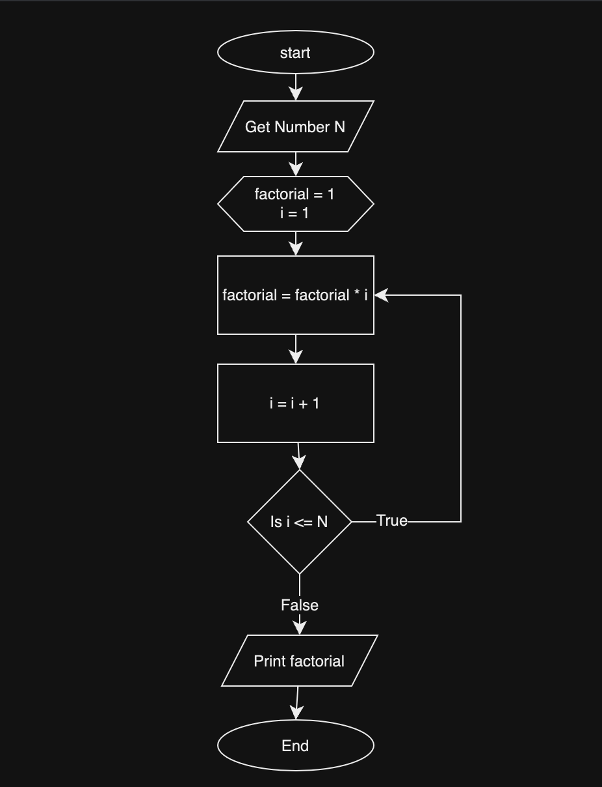

## flowchart
A flowchart is a graphical representation of a process or system, depicting the steps involved and the sequence in which they occur. It is a powerful tool used in various fields such as software development, engineering, business analysis, project management, and more. Flowcharts are designed to provide a visual understanding of complex procedures, enabling stakeholders to comprehend, analyze, and improve processes effectively.

### Tools to draw flow chart
- Draw.io (https://app.diagrams.net/)
- visual paradigm (https://www.visual-paradigm.com/)
- Lucid Chart (https://www.lucidchart.com/)
- Smart Draw (https://www.smartdraw.com/)
- Miro (https://miro.com/)
- etc.

## Flowchart for Factorial Number

### Steps

#### Input
n = 5
answer = 120

#### Preparation
factorial = 1
i = 1

#### iteration 1

factorial = 1
i = 2

#### iteration 2
factorial = 2
i = 3

#### iteration 3
factorial = 6
i = 4

#### iteration 4
factorial = 24
i = 5

#### iteration 5
factorial = 120
i = 6

#### Exit from the loop due to the False condition
Since i > n; exit from the loop

#### Print the factorial
