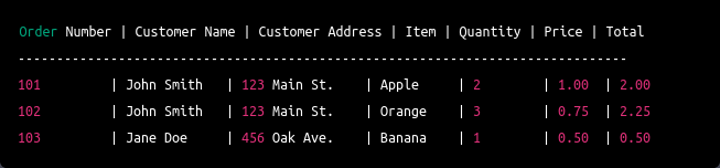

## Example Table NOT in 1NF

### Example 1

| OrderID | CustomerName | OrderDate   | Products            |
|---------|--------------|-------------|---------------------|
| 1       | Alice        | 2024-06-01  | [101, 102]          |
| 2       | Bob          | 2024-06-02  | [103]               |
| 3       | Charlie      | 2024-06-03  | [101, 103, 104]     |

### Example 2
StudentID | Name     | Courses
----------|----------|----------------------
1         | Alice    | Math, English
2         | Bob      | Science, Math

## Example Table NOT in 2NF 

### Example 1
note: here, there are two primary keys OrderID and ProductID

| OrderID | ProductID | OrderDate   | ProductName   | Price  |
|---------|-----------|-------------|---------------|--------|
| 1       | 101       | 2024-06-01  | Widget A      | 5000   |
| 1       | 102       | 2024-06-01  | Widget B      | 7000   |
| 2       | 103       | 2024-06-02  | Gadget X      | 3000   |
| 2       | 104       | 2024-06-02  | Gadget Y      | 2000   |
| 2       | 102       | 2024-06-02  | Gadget B      | 7000   |
| 3       | 101       | 2024-06-03  | Widget A      | 5000   |

### Example 2
note: here, there are two primary keys StudentID and CourseID

| StudentID | CourseID | StudentName | CourseName | Instructor  |
|-----------|----------|-------------|------------|-------------|
| 101       | CS101    | Alice       | CompSci    | Prof. Smith |
| 101       | MATH101  | Alice       | Math       | Prof. Jones |
| 102       | MATH101  | Bob         | Math       | Prof. Jones |
| 103       | PHYS101  | Carol       | Physics    | Prof. Brown |
| 103       | CS101    | Carol       | CompSci    | Prof. Smith |
| 104       | MATH101  | Dave        | Math       | Prof. Jones |
| 105       | CHEM101  | Eve         | Chemistry  | Prof. Green |

## Example Table Not in 3 NF

### Example 1
CourseDetails Table

| CourseID | CourseName       | LecturerName | Department       |
|----------|------------------|--------------|------------------|
| CS101    | Computer Science | Prof. Smith  | Computer Science |
| MATH101  | Mathematics      | Prof. Jones  | Mathematics      |
| PHYS101  | Physics          | Prof. Brown  | Physics          |
| CHEM101  | Chemistry        | Prof. Green  | Chemistry        |

### Example 2

MatchDetails Table

| MatchID  | Teams      | Ground  | Capacity  | 
|----------|------------|---------|-----------|
| M01      | NP vs IND  | TU      | 10000     |
| M02      | IND vs PAK | MULPANI | 25000     |
| M03      | PAK vs SRI | TU      | 10000     |
| M04      | SRI vs NP  | TU      | 10000     |
| M05      | NP vs BHU  | MULPANI | 25000     |

### Assignment: Normalize the table below in 1nf, 2nf and 3nf if necessary.

