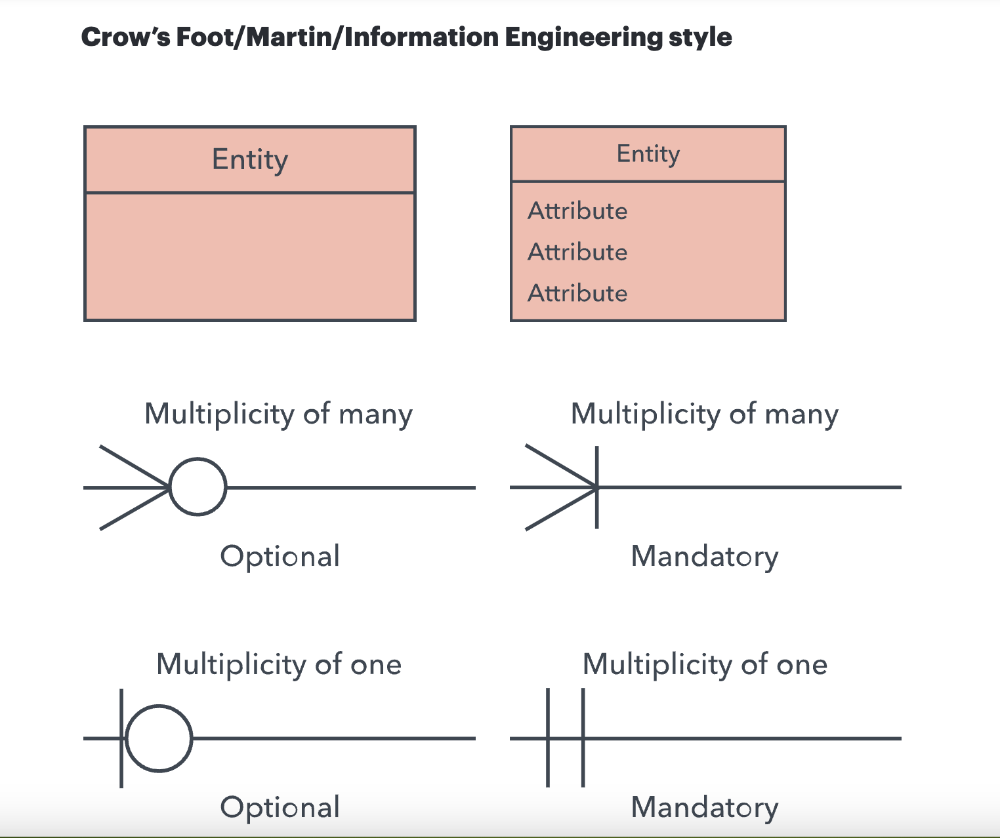
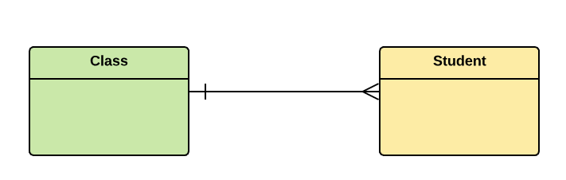
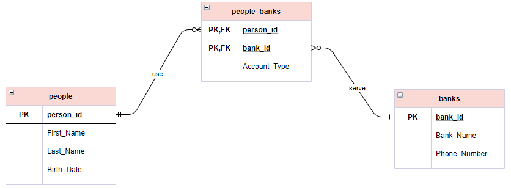
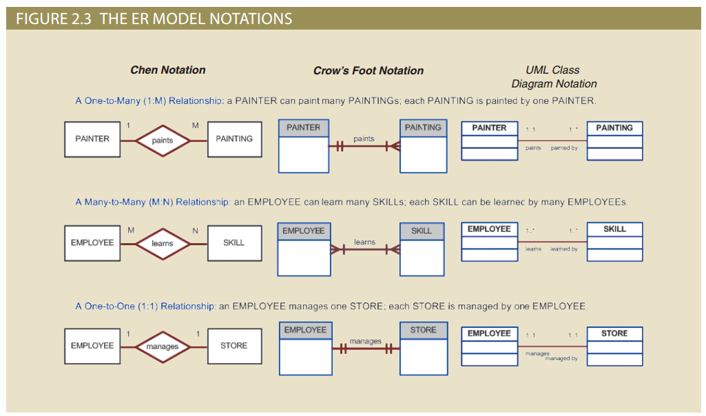

## ER Diagram
An Entity Relationship Diagram is a diagram that represents relationships among entities in a database.

### Entity
These are represented by rectangles and depict real-world objects or concepts that you want to store information about. For instance, in an library database, some entities could be "Book," "Author," and "Member."

### Attributes
These are ovals connected to their corresponding entities and represent the specific characteristics of an entity. An "Author" entity might have attributes like "author_name" and "birth_year."

### Relationship & Cardinality
**Relationship:** This refers to the general association or connection between two entities. It describes how the entities interact with each other.

**Cardinality:** ThisDefines the numerical attributes of the relationship between two entities or entity sets. The three main cardinal relationships are one-to-one, one-to-many, and many-many. 

**Examples:**

    In Online Shopping system, 
    1. Order and Delivery entity have One-to-One cardinality in relationship
    2. Customer and Order has One-to-Many relationship
    3. Order and Product has Many-to-Many relationship

### One to One

### Many to One | One to Many

### Many to Many

### Different Notation Styles
- UML Notation
- Crow's Foot Notation
- Chen Notation

## References: 
1. Video Tutorial: https://www.youtube.com/watch?v=HdaoufJNY_c&ab_channel=Drewity
2. https://www.lucidchart.com/pages/er-diagrams
3. https://www.visual-paradigm.com/guide/data-modeling/what-is-entity-relationship-diagram/