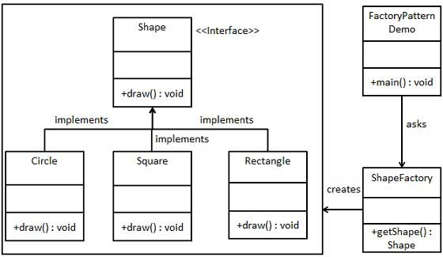

# READ THIS MENDATORY 
Click this link: https://refactoring.guru/design-patterns
Another: https://www.oodesign.com/

## Design Patterns

Design patterns are reusable solutions to common problems encountered in software design. They provide a structured approach to solving design problems and promote code reuse, maintainability, and scalability. 

## Gang of Four (GoF) Design Patterns
- The Gang of Four (GoF) is a group of four authors who wrote the influential book "Design Patterns: Elements of Reusable Object-Oriented Software." 
- Four authors are Erich Gamma, Richard Helm, Ralph Johnson, John Vlissides
- This book, published in 1994, cataloged 23 design patterns into three categories: Creational, Structural, and Behavioral. 
- These patterns were derived from their experience with designing software systems and captured common solutions to recurring design problems.

### Creational Patterns:
These patterns focus on object creation without specifying the exact class or subclass. They provide mechanisms for flexible and controlled object instantiation.

1. **Singleton Pattern**: Ensures that a class has only one instance and provides a global point of access to that instance.
    
    Eg. A logging class where only one instance needs to maintain the log entries.
    

2. **Factory Method Pattern**: Defines an interface for creating an object, but allows subclasses to alter the type of objects that will be created.
  
    Eg. A document creation application where the Factory Method can create different document types (Word, PDF) based on user selection.

1. **Abstract Factory Pattern**: Provides an interface for creating families of related or dependent objects without specifying their concrete classes.
  
    Eg. A UI framework where the Abstract Factory can create different UI elements (buttons, text boxes) based on the desired platform (Windows, Mac).
    

2. **Builder Pattern**: Separates the object construction process from its representation.
  
    Eg. Building a complex configuration object with multiple optional parameters.

      

3. **Prototype Pattern**: Creates new objects by cloning existing ones without dependency.
  
    Eg. Creating network connections where initial settings can be copied from a base prototype.
    

### Structural Patterns:
These patterns focus on composing classes and objects to form larger structures and functionalities. They deal with how classes and objects are structured and how they collaborate.

1. **Adapter Pattern**: Allows objects with incompatible interfaces to work together by providing a wrapper that converts the interface of one class into another interface.

    Eg. Using a card reader adapter to make an old computer compatible with newer SD cards.
    

2. **Bridge Pattern**: The Bridge Pattern decouples an abstraction from its implementation so that the two can vary independently. This allows for more flexible and maintainable code.

    Eg.  Separate game rendering logic (abstraction) from graphics API (implementation) for platform-independent game development.

3. **Facade Pattern**: Provides a simplified interface to a complex system of classes, making it easier to use

    Eg. An ATM interface that hides the underlying complexities of account management and transaction processing.
    

4. **Composite Pattern**: Treats a group of objects as a single object and allows for recursive operations.

    Eg. A file system where folders and files can be treated similarly for operations like copying or deleting.

5. **Decorator Pattern**: Allows behavior to be added to individual objects dynamically, without affecting the behavior of other objects from the same class.

    Eg. Decorating a text editor with features like spell checking or grammar suggestions.
 
6. **Proxy Pattern**: A security proxy that checks user permissions before allowing access to a resource.

    Eg. A security proxy that checks user permissions before allowing access to a resource.

7. **Flyweight Pattern**: Makes efficient use of memory by sharing similar objects.

    Eg. Reusing character icons in a word processing application instead of creating a new object for each instance.

### Behavioral Patterns:
These patterns focus on communication and interaction between objects. They define ways for objects to communicate with each other and share information.

1. **Strategy Pattern**: Defines a family of algorithms, encapsulates each one, and makes them interchangeable. Strategy lets the algorithm vary independently from clients that use it.

    Eg. A sorting algorithm where the strategy can be chosen (bubble sort, quick sort) based on data size.
    

2. **Observer Pattern**: Defines a one-to-many dependency between objects so that when one object changes state, all its dependents are notified and updated automatically.

    Eg. A stock market application where observers (investor accounts) are notified of price changes in specific stocks.

3. **Iterator Pattern**: Provides a way to access the elements of an aggregate object sequentially without exposing its underlying representation.

    Eg. Looping through items in a shopping cart without needing to know the internal storage implementation.

4. **Command Pattern**: Encapsulates a request as an object, thereby allowing parameterization of clients with queues, requests, and operations.

    Eg. Macro buttons in a graphics application that store and execute a sequence of commands.
    

5. **Template Method Pattern**: EDefines the skeleton of an algorithm in an operation, deferring some steps to subclasses.

    Eg. A data processing pipeline where the overall flow is defined but specific processing steps are implemented in subclasses.

6. **State Pattern**: The State design pattern allows an object to alter its behavior when its internal state changes, making it appear as if the object changes its class. 

    Eg. A light switch that changes its behavior (on/off) based on its internal state.
    

7. **Memento Pattern**: Captures and externalizes an object's internal state at a specific point in time. The saved state (memento) can be used to restore the object to its original state.

    Eg. Saving and restoring the state of a game to allow players to resume from previous checkpoints.

8. **Chain of Responsibility Pattern**: Allows a set of classes to handle a request one by one in a chain until the request is handled.

    Eg. A helpdesk system where a request is escalated to different support levels based on its complexity.

9. **Interpreter Pattern:**  Creates an interpreter for a specific language to execute a representation of that language.

    Eg. A calculator application that interprets mathematical expressions entered by the user.

10. **Mediator Pattern:** Defines an object that coordinates communication between a group of objects.

    Eg. An air traffic control system that coordinates communication between airplanes and ground control.

11. **Visitor Pattern:** Defines an operation to be performed on elements of an object structure without changing the structure itself.

    Eg. Analyzing a syntax tree in a compiler using a visitor pattern to perform different operations on different types of nodes.

## References: 
- You can see all design pattern class diagrams here 
    
    https://online.visual-paradigm.com/diagrams/templates/class-diagram/
- Read this mendatorily: 
    
    https://refactoring.guru/design-patterns

- Its also interesting series if you want to go deep
  
    https://www.youtube.com/watch?v=v9ejT8FO-7I&list=PLrhzvIcii6GNjpARdnO4ueTUAVR9eMBpc&ab_channel=ChristopherOkhravi