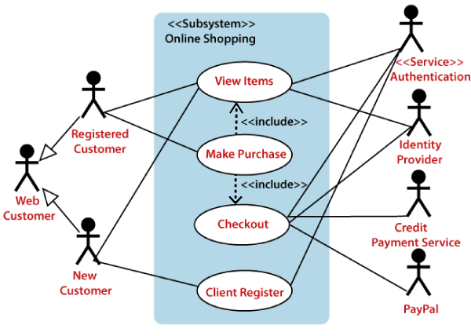

## UML Use Case Diagram
A use case diagram is used to represent the dynamic behavior of a system. It encapsulates the system's functionality by incorporating use cases, actors, and their relationships. It models the tasks, services, and functions required by a system/subsystem of an application. It depicts the high-level functionality of a system and also tells how the user handles a system.

## Purpose of Use Case Diagrams
The main purpose of a use case diagram is to portray the dynamic aspect of a system. It accumulates the system's requirement, which includes both internal as well as external influences. It invokes persons, use cases, and several things that invoke the actors and elements accountable for the implementation of use case diagrams. It represents how an entity from the external environment can interact with a part of the system.

Following are the purposes of a use case diagram given below:

- It gathers the system's needs.
- It depicts the external view of the system.
- It recognizes the internal as well as external factors that influence the system.
- It represents the interaction between the actors.

## How to draw a Use Case diagram?
It is essential to analyze the whole system before starting with drawing a use case diagram, and then the system's functionalities are found. And once every single functionality is identified, they are then transformed into the use cases to be used in the use case diagram.

After that, we will enlist the actors that will interact with the system. The actors are the person or a thing that invokes the functionality of a system. It may be a system or a private entity, such that it requires an entity to be pertinent to the functionalities of the system to which it is going to interact.

Once both the actors and use cases are enlisted, the relation between the actor and use case/ system is inspected. It identifies the no of times an actor communicates with the system. Basically, an actor can interact multiple times with a use case or system at a particular instance of time.

Following are some rules that must be followed while drawing a use case diagram:

- A pertinent and meaningful name should be assigned to the actor or a use case of a system.
- The communication of an actor with a use case must be defined in an understandable way.
- Specified notations to be used as and when required.
- The most significant interactions should be represented among the multiple no of interactions between the use case and actors.

## Example of a Use Case Diagram
A use case diagram depicting the Online Shopping website is given below.

Here the Web Customer actor makes use of any online shopping website to purchase online. The top-level uses are as follows; View Items, Make Purchase, Checkout, Client Register. The View Items use case is utilized by the customer who searches and view products. The Client Register use case allows the customer to register itself with the website for availing gift vouchers, coupons, or getting a private sale invitation. It is to be noted that the Checkout is an included use case, which is part of Making Purchase, and it is not available by itself.

The View Items is further extended by several use cases such as; Search Items, Browse Items, View Recommended Items, Add to Shopping Cart, Add to Wish list. All of these extended use cases provide some functions to customers, which allows them to search for an item. The View Items is further extended by several use cases such as; Search Items, Browse Items, View Recommended Items, Add to Shopping Cart, Add to Wish list. All of these extended use cases provide some functions to customers, which allows them to search for an item.

Both View Recommended Item and Add to Wish List include the Customer Authentication use case, as they necessitate authenticated customers, and simultaneously item can be added to the shopping cart without any user authentication.

Similarly, the Checkout use case also includes the following use cases, as shown below. It requires an authenticated Web Customer, which can be done by login page, user authentication cookie ("Remember me"), or Single Sign-On (SSO). SSO needs an external identity provider's participation, while Web site authentication service is utilized in all these use cases.

The Checkout use case involves Payment use case that can be done either by the credit card and external credit payment services or with PayPal.

Important tips for drawing a Use Case diagram

Following are some important tips that are to be kept in mind while drawing a use case diagram:

- A simple and complete use case diagram should be articulated.
- A use case diagram should represent the most significant interaction among the multiple interactions.
- At least one module of a system should be represented by the use case diagram.
- If the use case diagram is large and more complex, then it should be drawn more generalized.

## References:
- In Lucid Chart:  https://www.youtube.com/watch?v=4emxjxonNRI&ab_channel=LucidSoftware